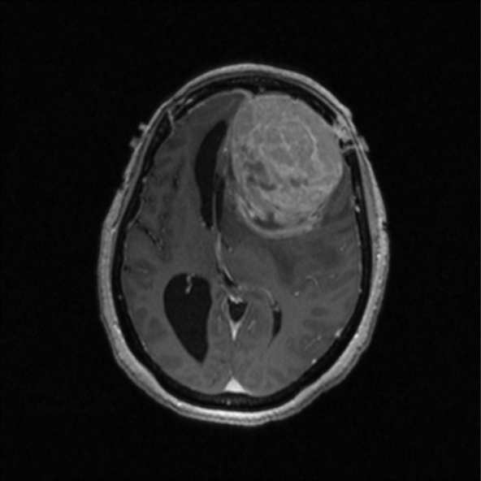

#  Meningioma Molecular Subgroup Identification via Radiogenomic Texture Analysis of mpMRI

[](https://www.python.org)
[](https://github.com/psf/black)

## Overview

This work learns simple & interpretable LASSO logistic regression models that–given radiomic texture features extracted from a patient's mpMRI images–are able to predict the molecular subgroup of three genetic biomarkers of interest:

1. DNA methylation subtype {Merlin Intact, Immune Enriched, Hypermetabolic}
2. Chromosome 22q status {Intact, Lost}
3. Chromosome 1p status {Intact, Lost}

The following four pulse sequences comprise the mpMRI used in this work: T1 post-contrast enhanced, FLAIR, DWI, and ADC. [PyRadiomics](https://pyradiomics.readthedocs.io/en/latest/#) and [CoLlAGe](https://collageradiomics.readthedocs.io/en/latest/) feature sets are used in the texture analysis.

## Environment set up

All dependencies needed to run Python scripts are listed in [`environment.yml`](environment.yml). Create and activate the [conda](https://www.anaconda.com/docs/getting-started/miniconda/install) environment with:

```bash
conda env create -f environment.yml
conda activate men-rad
```

The data used in this project are not publicly available to comply with IRB protocol.

## Workflow

The [`code/utils/paths.py`](code/utils/paths.py) file sets all the necessary filepaths that all Python scripts will refer to. Python scripts carry out the following sequential workflow (see the below linked READMEs for further details on each step):

0. [Preprocessing](code/0_preprocessing/README.md):
    - File clean up
    - Scan type clean up
    - DICOM to NIfTI conversion
    - N4 bias field correction
    - Skull stripping
    - Intensity normalization
    - Image registration
1. [Radiomics feature extraction](code/1_feature_extraction/README.md):
    - PyRadiomics
    - CoLlAGe
2. [Modeling](code/2_modeling/README.md):
    - LASSO logistic regression
    - Nested leave-two-out cross-validation

## Citation

Citation forthcoming.
